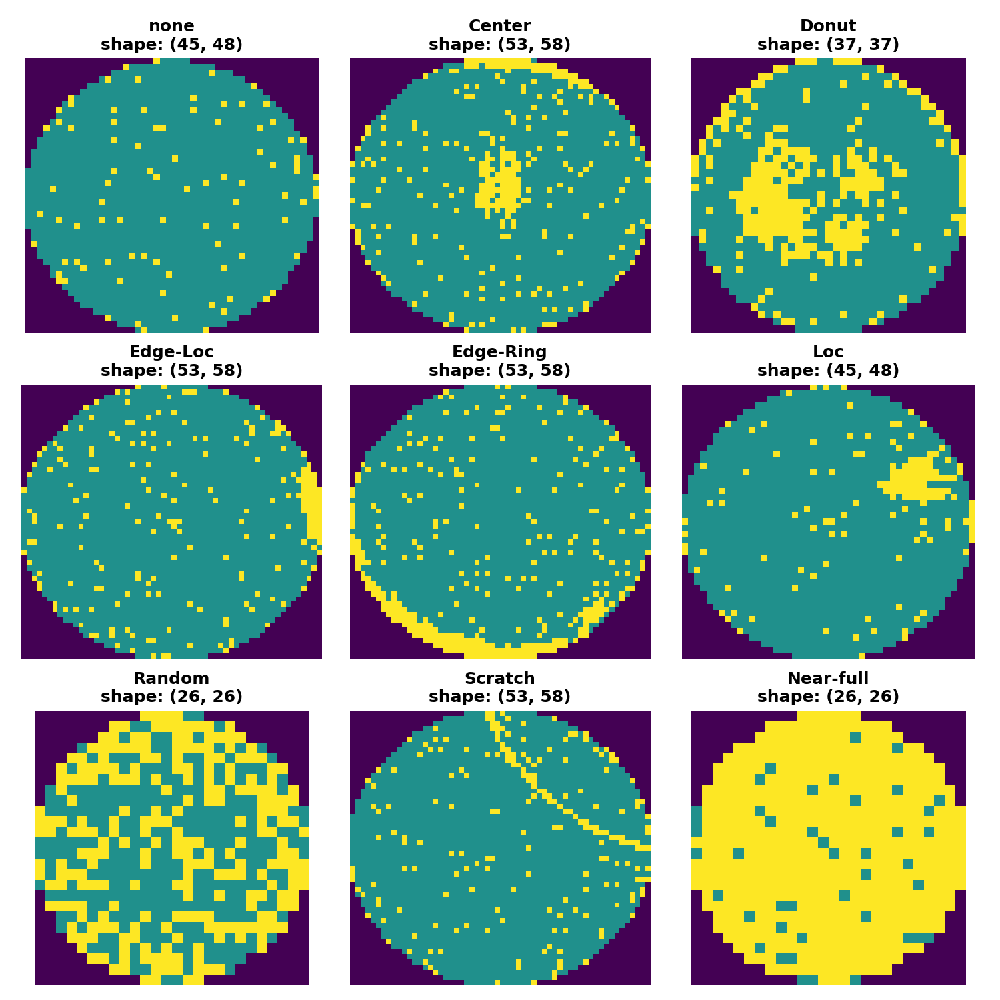
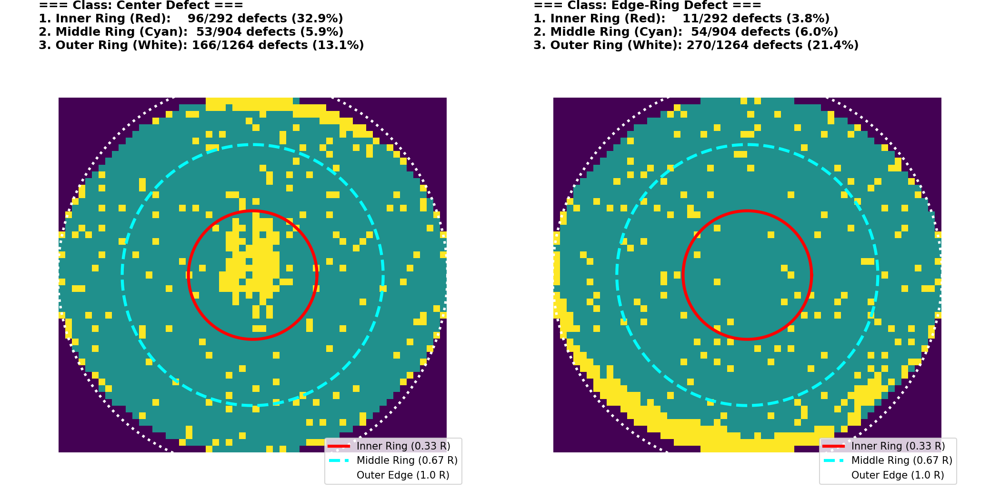
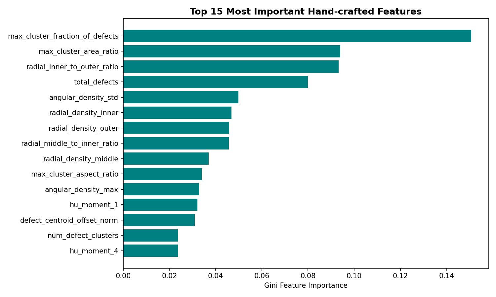
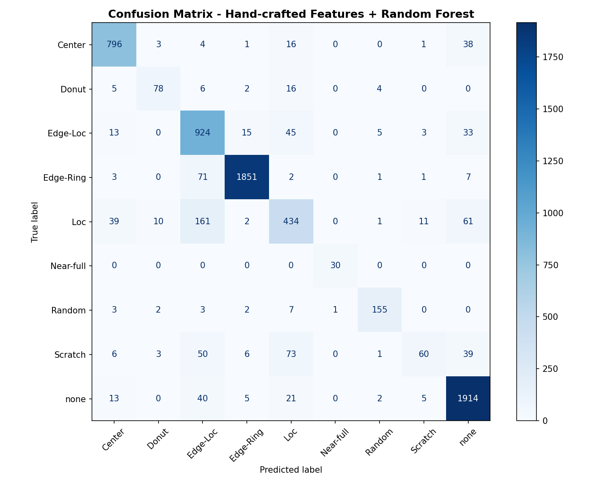
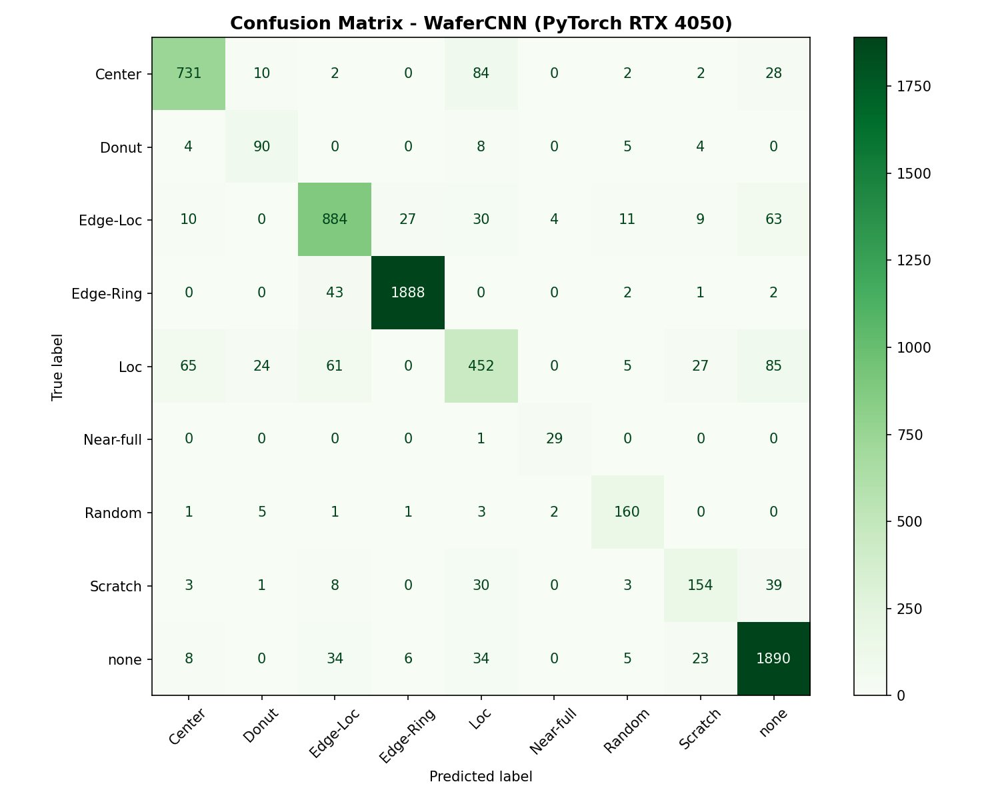
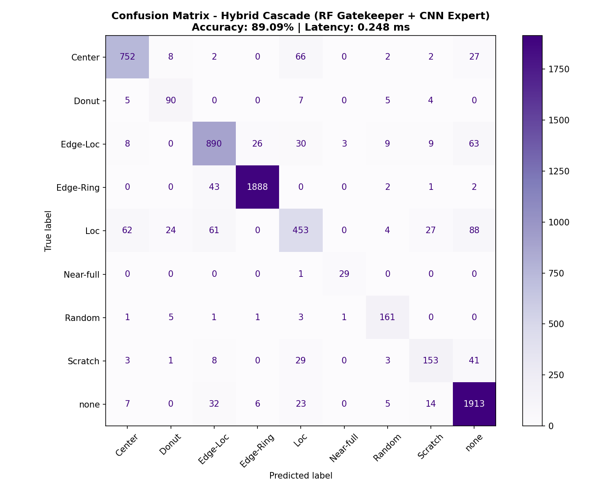

# 🔬 Wafer Map Defect Pattern Recognition: An Engineering Journey (WM-811K)

[](https://www.python.org/)
[](https://pytorch.org/)
[](https://onnxruntime.ai/)
[](https://www.kaggle.com/datasets/qingyi/wm811k-wafer-map)

> **About this project:** This repository documents my step-by-step engineering journey exploring semiconductor wafer defect classification using the real-world **WM-811K dataset** (811,457 production wafers). Rather than jumping blindly into complex deep learning models, I tackled this project like a manufacturing engineer: analyzing raw data physics, hand-crafting geometric baselines, diagnosing why algorithms fail on tricky defects like scratches, creating a cost-effective hybrid cascade, pushing accuracy with attention networks, and finally building visual explainability (Grad-CAM) and edge-benchmarked ONNX deployment.

---

## 🧭 The Engineering Roadmap

Here is how the project evolved from raw pickle files to a production-ready edge inference pipeline:

```
[ Step 1: Data Audit ]
       │  Discovered 78% unlabeled wafers, extreme imbalance, and multi-resolution grids
       ▼
[ Step 2: Physical Preprocessing ]
       │  Enforced Nearest-Neighbor (cv2.INTER_NEAREST) to protect discrete die physics {0, 1, 2}
       ▼
[ Step 3: The Handcrafted Baseline ]
       │  Engineered 29 geometric features (rings, octants, Hu moments) + Random Forest
       │  Result: 87.87% acc, super fast (0.49 ms), but Scratch Recall crashed at 25.21%
       ▼
[ Step 4: The Plain CNN Leap ]
       │  Built WaferCNN (3 Conv blocks + GAP) to learn spatial curves directly
       │  Result: Scratch Recall jumped from 25.21% -> 64.71% (+39.5% gain)
       ▼
[ Step 5: The "Aha!" Moment — Hybrid Cascade ]
       │  "Why burn GPU power on normal wafers when RF already handles them in 0.005 ms?"
       │  RF gates high-confidence wafers on CPU; escalates ambiguous / scratch risks to CNN
       │  Result: 89.09% acc, fastest overall (0.248 ms, >4,000 wafers/sec), 57.7% CPU offload
       ▼
[ Step 6: Pushing SOTA with WaferResNet ]
       │  Residual skip connections (prevent scratch line vanishing) + Squeeze-and-Excitation attention
       │  Result: 93.79% acc, 90.88% Macro F1, Scratch Recall jumped to 82.77%
       ▼
[ Step 7: Explainable AI & Edge Deployment ]
          Grad-CAM root-cause overlays + ONNX Runtime benchmark (0.67 ms on standard CPU)
```

---

## 1. Diving into the Data & Finding the Traps

When I first loaded `LSWMD.pkl` (2.09 GB), I quickly realized that real factory data is messy:
1. **The Unlabeled Void:** Out of 811,457 wafers, **638,507 wafers (78.7%) have no defect labels at all**. Only 172,950 wafers had failure labels.
2. **Extreme Class Imbalance:** Clean wafers (`none`) dominated with 147,431 samples. In contrast, critical defects like `Scratch` had only 1,193 wafers, and catastrophic failures like `Near-full` had a measly 149 wafers.
3. **Variable Die Resolutions:** Wafers were not uniform images. Some measured 26×26 dies, while others were 50×50 or 60×60.


*Figure 1: The 8 real defect patterns in WM-811K: Center, Donut, Edge-Loc, Edge-Ring, Loc, Random, Scratch, Near-full, and Normal (none).*

### ⚠️ The Nearest-Neighbor Lesson (Don't Interpolate Numbers!)
Standard image resizing defaults to bilinear or bicubic interpolation. But in semiconductor manufacturing, wafer dies are **discrete physical entities**:
- `0`: Outside wafer substrate (empty space)
- `1`: Normal die (passed electrical probe test)
- `2`: Defective die (failed electrical probe test)

If you resize with bilinear interpolation, a die between normal (1) and defect (2) becomes `1.42`—which has zero physical meaning! Therefore, I strictly enforced `cv2.INTER_NEAREST` to keep die states crisp and converted each wafer into a one-hot 3-channel tensor ($3 \times 56 \times 56$).

---

## 2. Baseline 1: Can Handcrafted Geometry Solve This?

Before touching deep learning, I wanted to see how far classical domain engineering could take us. Looking at the wafer maps, human engineers recognize defects by symmetry and location:
- Rings are concentric
- Edge-Loc is directional
- Center is clustered at the core

So I hand-crafted **29 geometric & spatial features** (`src/features.py`):
- **8 Concentric Ring Densities:** Counting defect ratios in 8 radial zones from core to edge.
- **8 Directional Octants:** Dividing the wafer like a pizza into $45^\circ$ wedges to detect directional clusters.
- **Centroid Offsets:** Distance between the wafer center and the center-of-mass of defect dies.
- **Hu Moments (7 features):** Scale-, rotation-, and translation-invariant shape descriptors.
- **Bounding Box Metrics:** Aspect ratio ($W/H$) and bounding box fill ratio.


*Figure 2: Verifying our 8 concentric ring masks and 8 directional octant masks.*

I trained a **Random Forest** classifier on these 29 features:
- **Accuracy:** 87.87%
- **Inference Speed:** **0.49 ms** on CPU (Feature extraction: 0.487 ms, Tree inference: 0.006 ms)


*Figure 3: Feature importance showing concentric ring 8 (outer edge) and octant densities leading the classification.*

### ❌ The Catch: Why the Baseline Failed on Scratches
While the RF model scored nearly 88% overall, the confusion matrix revealed a critical blind spot:


*Figure 4: The Random Forest confusion matrix showing Scratch Recall at an unacceptable 25.21%.*

**The Physics of the Failure:**
To detect long lines like scratches, I used the Bounding Box Aspect Ratio ($W/H$).
- A horizontal scratch ($W=40, H=2$) has an aspect ratio of $20.0$ (Easy to detect).
- But a **diagonal scratch at $45^\circ$** spans $W=40, H=40$, yielding an aspect ratio of **$1.0$**!
The classifier couldn't distinguish a diagonal scratch from a circular cluster (`Loc`), missing **75% of all scratches**.

---

## 3. Baseline 2: Letting Plain CNN Learn the Curves

To fix the diagonal scratch problem, we needed convolutional filters that scan across local receptive fields. I built `WaferCNN`:
- 3 Convolutional Blocks (32 $\rightarrow$ 64 $\rightarrow$ 128 channels) with BatchNorm and ReLU
- Global Average Pooling (GAP) to prevent overfitting on spatial locations
- 2-layer MLP classifier with Dropout (0.3)
- Total parameters: ~102,000

I trained it on an NVIDIA RTX 4050 Laptop GPU using CUDA 12.4 for 30 epochs (59.8 seconds total).


*Figure 5: WaferCNN confusion matrix — Scratch Recall leaped from 25.21% to 64.71%.*

**What changed:**
- **Overall Accuracy:** 88.37%
- **Scratch Recall:** Jumped from **25.21% $\rightarrow$ 64.71% (+39.5% absolute gain!)**
- **GPU Latency:** 0.421 ms

The spatial convolution kernels successfully captured thin continuous strokes regardless of their orientation.

---

## 4. The "Aha!" Moment: Why Not a Hybrid Cascade?

While testing both models, an engineering question popped up:
> *"In a real semiconductor fab, >90% of incoming wafers are normal or have obvious ring defects. The Random Forest handles these on a basic CPU in 0.005 ms with >95% precision. Why waste expensive GPU power passing every single normal wafer through a deep CNN?"*

I built a **Hybrid Cascade System** (`scripts/evaluate_cascade.py`):
1. **Stage 1 (RF Gatekeeper on CPU):** Fast feature extraction. If the RF model predicts with high confidence ($\ge 85\%$) AND the prediction is NOT `Scratch`, we accept the RF output immediately.
2. **Stage 2 (CNN Expert on GPU):** If confidence is low ($< 85\%$) OR the wafer looks like a `Scratch`, escalate the sample to the CNN.


*Figure 6: Hybrid Cascade confusion matrix achieving 89.09% accuracy.*

### The Payoff:
- **Workload Offloaded to CPU:** **57.69%** of all wafers were finalized in Stage 1 without ever waking up the GPU!
- **Average Latency:** **0.248 ms/wafer** — **the fastest architecture in the entire project (>4,000 wafers/sec)**.
- **Overall Accuracy:** Rose to **89.09%** (Macro F1: 84.12%).

---

## 5. Pushing the Limits: WaferResNet with Attention

Even with the CNN, a Scratch Recall of 64.7% still meant 1 out of 3 scratches slipped through undetected. In chip manufacturing, scratches are catastrophic because they indicate mechanical wafer handling arm abrasion or slurry grit in chemical mechanical polishing (CMP).

To solve this, I designed **`WaferResNet`** (~318k parameters) with two specific enhancements:
1. **Residual Skip Connections:** Thin scratches are only 1-die wide. Deep downsampling in standard CNNs washes these fine lines away. Residual connections allow faint scratch signals to bypass convolutional bottlenecks intact.
2. **Squeeze-and-Excitation (SE) Channel Attention:** Normal dies outnumber defect dies 100:1 on a wafer. The SE module dynamically recalibrates channel weights, boosting responses on the defect channel while muting background noise dies.


*Figure 7: Bounded Physical Augmentation (90°, 180°, 270° rotations + flips) expanding rare training defects from 20,415 to 44,292 without introducing unrealistic synthetic artifacts.*

I trained `WaferResNet` for 40 epochs with AdamW, Cosine Annealing, and Class-Weighted Cross-Entropy:


*Figure 8: WaferResNet confusion matrix achieving state-of-the-art 93.79% test accuracy.*

### WaferResNet Results:
- **Overall Accuracy:** **93.79%** (Macro F1: **90.88%**)
- **Scratch Recall:** Rose to **82.77%** (197 out of 238 detected, Precision: 87.56%, F1: 85.10%)
- **Edge-Ring F1:** **98.03%** | **Center F1:** **95.52%** | **Normal (none) F1:** **96.06%**

---

## 6. The Big Comparison: Trade-offs & Production Viability

Every engineering choice involves a trade-off between accuracy, computation, and hardware cost:

| Model | Test Accuracy | Macro F1 | Scratch Recall | Latency per Wafer | Throughput | Best Used For |
| :--- | :---: | :---: | :---: | :---: | :---: | :--- |
| **Baseline RF** | 87.87% | 81.07% | 25.21% | 0.493 ms (CPU) | ~2,000 / sec | Low-power microcontroller / edge IoT |
| **WaferCNN** | 88.37% | 83.03% | 64.71% | 0.421 ms (GPU) | ~2,370 / sec | Simple embedded vision cameras |
| **Hybrid Cascade** ⚡ | 89.09% | 84.12% | 64.29% | **0.248 ms (Mixed)** | **>4,000 / sec** | **High-speed wafer sorting lines (Low GPU cost)** |
| **WaferResNet** ⭐ | **93.79%** | **90.88%** | **82.77%** | 0.669 ms (ONNX) | ~1,500 / sec | **High-precision defect metrology & yield audit** |

---

## 7. Explainable AI (Grad-CAM): Opening the Black Box

In cleanrooms, an AI that simply outputs `"Scratch: 94%"` without proof will be ignored by process engineers. If the AI flags a scratch, the tool technician needs to know *where* the damage is located to inspect the physical chamber.

I implemented **Grad-CAM** (`src/explainability.py`) to extract gradients from the final residual block and project attention back onto the original wafer map:


*Figure 9: Four-stage diagnostic report. Column 1: Original wafer. Column 2: Defect die mask. Column 3: Raw Grad-CAM heatmap. Column 4: Soft attention overlay showing exactly which dies triggered the AI's decision.*

### What the Heatmaps Reveal:
- **Scratch:** The AI ignores random noise dies scattered around the wafer and shines its spotlight directly along the stroke of the scratch line.
- **Center:** Focuses exclusively on the central core cluster.
- **Donut:** Highlights the ring perimeter encircling the hollow core.
- **Edge-Ring:** Notice that the center of the wafer remains completely dark—the model attends solely to the outer perimeter in all four quadrants.
- **Loc:** Focuses tightly on the localized cluster at the bottom-right corner.

---

## 8. Exporting to ONNX & Edge Benchmarking

To prove this model is ready for real factory automation (e.g., C++/C# inspection software on an industrial PC):
1. Exported `WaferResNet` to ONNX (`models/wafer_resnet.onnx` — only **1.23 MB**).
2. Verified FP32 numerical parity against PyTorch ($\max |\Delta| = 6.1 \times 10^{-5}$).
3. Benchmarked inference using **ONNX Runtime 1.29** across batch sizes:

```
Provider: Intel/AMD x86 (Standard CPU)
- Batch  1 (Single Wafer / Real-time station) : 1.28 ms/wafer  (780.7 wafers/sec)
- Batch 32 (Industrial PC inline inspection)  : 0.67 ms/wafer  (1,493.8 wafers/sec)
- Batch 64 (Batch test cell)                  : 0.79 ms/wafer  (1,273.4 wafers/sec)
```

---

## 🛠️ Reproduction & Quickstart

### 1. Setup Environment
```bash
git clone https://github.com/teeranon124/WM-811k-WaferMap.git
cd WM-811k-WaferMap

python -m venv .venv
.\.venv\Scripts\activate      # On Linux/Mac: source .venv/bin/activate
pip install -r requirements.txt
```

### 2. Dataset Setup
Download `LSWMD.pkl` (2.09 GB) from Kaggle's [WM-811K Dataset](https://www.kaggle.com/datasets/qingyi/wm811k-wafer-map) and place it in the `data/` directory:
```bash
kaggle datasets download -d qingyi/wm811k-wafer-map -p data/ --unzip
```

### 3. Run the Pipelines
```bash
# Preprocess with nearest-neighbor & physical rotation augmentation
python scripts/prepare_dataset.py

# Train baseline models
python scripts/train_handcrafted_rf.py
python scripts/train_cnn.py
python scripts/evaluate_cascade.py

# Train WaferResNet (Attention + Residuals)
python scripts/train_resnet.py

# Generate Grad-CAM explainability diagnostics
python scripts/generate_gradcam_demo.py

# Export to ONNX and run edge benchmark
python scripts/export_onnx.py
```

---

## 👨‍💻 Author

**Teeranon**  
*3rd-Year AI Engineering Student*  
*Faculty of Engineering, Prince of Songkla University (PSU), Hat Yai*  
Interests: Industrial Computer Vision, Edge Machine Learning, and Defect Metrology.  
Targeting Summer 2026 Engineering Internships in Semiconductor Manufacturing, Precision Storage, and Optics (Sony Semiconductor / Seagate Technology).

---

## 📄 License
This project is open source and available under the [MIT License](LICENSE).
