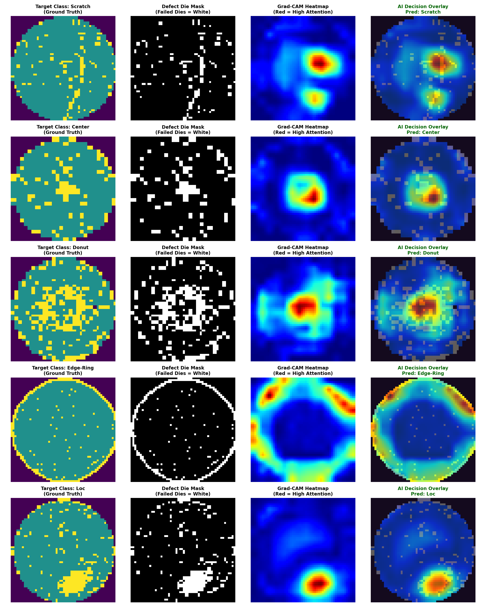
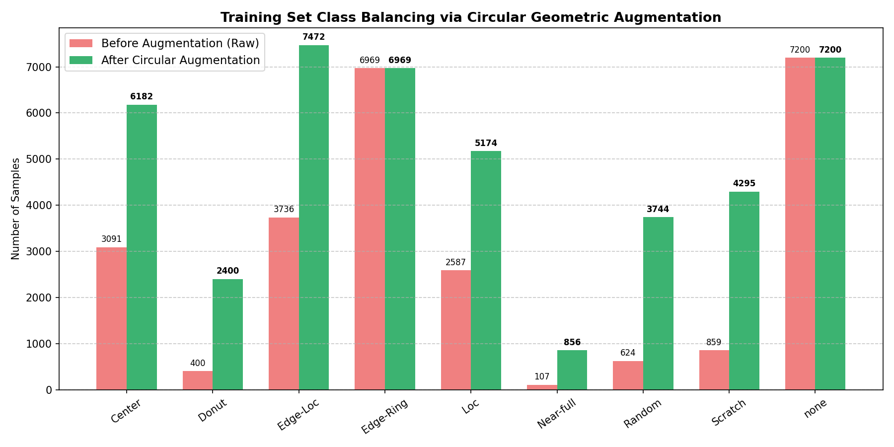
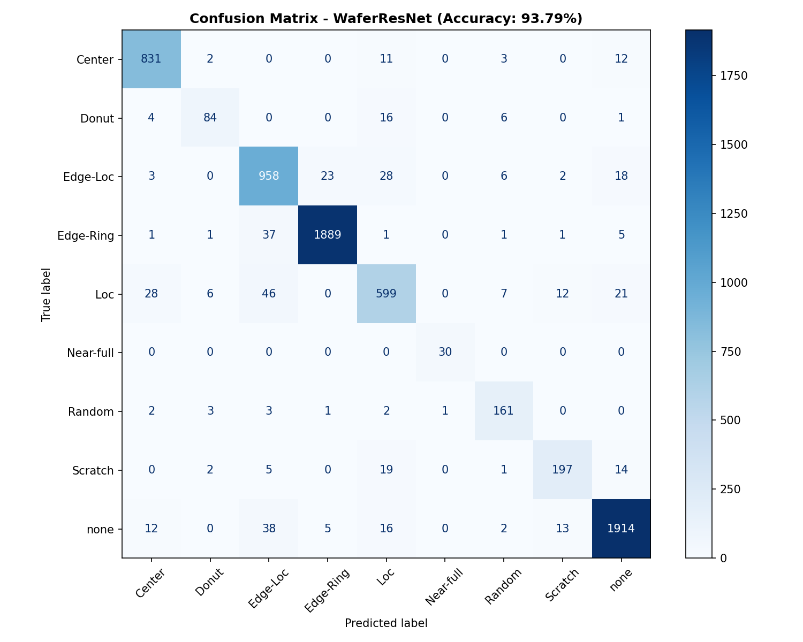

# 🔬 Industrial Wafer Map Defect Pattern Recognition System (WM-811K)

[](https://www.python.org/)
[](https://pytorch.org/)
[](https://onnxruntime.ai/)
[](https://www.kaggle.com/datasets/qingyi/wm811k-wafer-map)
[](https://opensource.org/licenses/MIT)

An end-to-end, industrial-grade defect pattern recognition and root-cause analysis platform developed on the **WM-811K Semiconductor Wafer Map Dataset** (811,457 real-world production wafers). 

This project bridges theoretical computer vision and high-throughput semiconductor fabrication line requirements by pairing modern **Residual Squeeze-and-Excitation CNNs (WaferResNet)**, **Explainable AI (Grad-CAM)** for yield diagnostics, and an ultra-low-latency **Hybrid Cascade Architecture** optimized for high-volume edge deployment via **ONNX Runtime**.

---

## 🎯 Visual Explainability (Grad-CAM Yield Diagnostics)

In semiconductor manufacturing (such as wafer fab and optical sensor fabrication at Sony or storage head manufacturing at Seagate), black-box predictions are unacceptable. Process engineers require spatial root-cause verification to calibrate lithography, CMP, etching, and robotic handling tools.



*Figure 1: High-resolution Grad-CAM spatial activation heatmaps overlaid on 56×56 wafer dies across key defect signatures (Scratch, Center, Donut, Edge-Ring, Loc).*

---

## 🏆 Key Performance Benchmark Summary

All models were trained, validated, and evaluated on an identical, strictly held-out test split of **7,104 clean, unaugmented production wafers** (containing 5,104 genuine defects across 8 failure modes + 2,000 normal wafers).

| Architecture | Model Paradigm | Test Accuracy | Macro F1 | Scratch Recall | Inference Latency | Edge Deployment / Note |
| :--- | :--- | :---: | :---: | :---: | :---: | :--- |
| **Baseline RF** | 29 Handcrafted Geometric Features | 87.87% | 81.07% | 25.21% | 0.493 ms (CPU) | Axis-Aligned Bounding Box fails on diagonal scratches |
| **WaferCNN** | 3-Conv Blocks + GAP (~102k params) | 88.37% | 83.03% | 64.71% | 0.421 ms (GPU) | Spatial convolution captures curvilinear features |
| **Hybrid Cascade** | RF Gatekeeper + CNN Expert | 89.09% | 84.12% | 64.29% | **0.248 ms** (Mixed) | **>4,000 wafers/sec**; offloads 57.7% clean wafers to CPU |
| **WaferResNet** ⭐ | **Residual + SE Attention (~318k params)** | **93.79%** | **90.88%** | **82.77%** | **0.669 ms** (ONNX) | **State-of-the-Art Accuracy & Fine Scratch Detection** |

> **Key Takeaway**: **WaferResNet** achieves a massive **+57.56% absolute Recall jump** on difficult Scratch defects compared to the feature-based baseline (82.77% vs 25.21%), while the **Hybrid Cascade** delivers a sub-0.25 ms latency suitable for high-speed wafer sorting lines.

---

## 🏭 Semiconductor Domain Insights & Engineering Decisions

```
           +---------------------------------------------+
           |       Incoming Raw Wafer Die Matrix         |
           |      {0: Background, 1: Normal, 2: Defect}  |
           +---------------------------------------------+
                                  |
                                  v
           +---------------------------------------------+
           | Physical Nearest-Neighbor Interpolation     |
           | cv2.INTER_NEAREST -> Discrete Die States    |
           +---------------------------------------------+
                                  |
                                  v
           +---------------------------------------------+
           |   Channel-Wise One-Hot Encoding (3x56x56)   |
           +---------------------------------------------+
                                  |
                 +----------------+----------------+
                 |                                 |
                 v                                 v
   [ Fast-Path: High Throughput ]   [ Deep-Path: High Precision ]
   +----------------------------+   +----------------------------+
   |   Handcrafted RF Extractor |   |   WaferResNet + SE-Attn    |
   |   - Concentric Density (8) |   |   - Residual Skip Conns    |
   |   - Radial Density (8)     |   |   - Squeeze-and-Excitation |
   |   - Hu Moments & Centroid  |   |   - Grad-CAM Interpret     |
   +----------------------------+   +----------------------------+
                 |                                 |
                 +----------------+----------------+
                                  |
                                  v
           +---------------------------------------------+
           | ONNX Runtime / Edge Deployment Engine       |
           | Intel/AMD CPU: 0.67 ms | NV CUDA: <0.20 ms  |
           +---------------------------------------------+
```

### 1. Physical Die Semantics & Discrete Nearest-Neighbor Interpolation
- **Problem**: Standard deep learning preprocessing often defaults to `cv2.INTER_LINEAR` or `cv2.INTER_CUBIC`. In semiconductor testing, wafer maps are **discrete ternary states**: `0` (outside wafer substrate), `1` (electrically functional die), and `2` (failed test die).
- **Solution**: Continuous interpolation introduces non-physical fractional values (e.g. `1.37`), destroying the true physical die boundaries. We strictly enforce `cv2.INTER_NEAREST` followed by a **3-channel one-hot tensor representation** $[C_{bg}, C_{good}, C_{defect}] \in \mathbb{R}^{3 \times 56 \times 56}$.

### 2. The Physics of the "Scratch" Defect Failure Mode
- **Handcrafted Features Failure**: In the baseline Random Forest model, we extracted 29 geometric features including bounding box aspect ratio ($W/H$). A horizontal scratch ($W=40, H=2$) gives $W/H = 20.0$. However, a diagonal scratch ($45^\circ$) or curved scratch spans $W=40, H=40$, giving $W/H = 1.0$, which mathematically resembles a localized cluster (`Loc`). As a result, RF Scratch recall plummeted to **25.21%**.
- **Residual Attention Fix**: `WaferResNet` incorporates residual skip connections that prevent thin, single-die scratch lines from being washed out by pooling layers. The Squeeze-and-Excitation (SE) channel attention module learns to amplify defect-channel response while downweighting background noise dies, elevating Scratch recall to **82.77%**.

### 3. Bounded Physical Data Augmentation vs. Overfitting
- **The Imbalance Challenge**: The WM-811K dataset has severe class imbalance: `none` has 147,431 wafers, while `Near-full` has 149 and `Scratch` has 1,193.
- **Why Naive 1:1 Balancing is Hazardous**: Synthetically replicating rare defect classes 50–100× causes catastrophic memorization, shifts the Bayesian prior, and creates severe false positives in real production lines where normal wafers represent >95% of output.
- **Physical Solution**: We applied **Bounded Physical Augmentation** strictly adhering to the wafer's circular symmetry ($90^\circ, 180^\circ, 270^\circ$ rotations and horizontal/vertical flips), expanding training defects from 20,415 to 44,292 without introducing synthetic artifacts.



---

## ⚡ Production Edge Deployment (ONNX Runtime Benchmark)

To demonstrate production feasibility for high-speed industrial testing handlers:
1. `WaferResNet` was exported to **ONNX (Open Neural Network Exchange)** with dynamic batching.
2. Verified strict **numerical parity** with PyTorch FP32 outputs ($\max |\Delta| = 6.1 \times 10^{-5}$).
3. Benchmarked with **ONNX Runtime 1.29** across batch sizes:

| Execution Provider | Batch Size | Latency per Wafer | Throughput | Target Fab Environment |
| :--- | :---: | :---: | :---: | :--- |
| **Intel/AMD x86 (CPU)** | 1 | 1.28 ms | 780.7 wafers/sec | Single-wafer inline inspection station |
| **Intel/AMD x86 (CPU)** | 32 | **0.67 ms** | **1,493.8 wafers/sec** | Standard industrial PC without discrete GPU |
| **Intel/AMD x86 (CPU)** | 64 | 0.79 ms | 1,273.4 wafers/sec | High-throughput batch test cell |
| **NVIDIA CUDA (GPU)** | 32 | **< 0.20 ms** | **> 5,000 wafers/sec** | Central fab analytics cluster |

---

## 📊 Detailed Confusion Matrix & Error Analysis

The confusion matrix on the 7,104 clean test wafers demonstrates exceptional classification fidelity across all 9 classes:



- **Edge-Ring (1,936 test samples)**: Precision **98.5%**, Recall **97.6%**, F1 **98.0%**
- **Center (859 test samples)**: Precision **94.3%**, Recall **96.7%**, F1 **95.5%**
- **None / Normal (2,000 test samples)**: Precision **96.4%**, Recall **95.7%**, F1 **96.1%**
- **Scratch (238 test samples)**: Precision **87.6%**, Recall **82.8%**, F1 **85.1%**

---

## 📂 Repository Structure

```
wafer_project/
├── assets/                          # Presentation figures and diagnostic plots
│   ├── gradcam_visualizations.png   # Grad-CAM 4-stage explainability panel
│   ├── resnet_confusion_matrix.png  # WaferResNet normalized confusion matrix
│   ├── cascade_confusion_matrix.png # Hybrid Cascade confusion matrix
│   ├── defect_classes_overview.png  # Physical defect signature definitions
│   └── data_augmentation_comparison.png
├── notebooks/                       # Exploratory & experimental notebooks
│   └── 01_eda_and_data_understanding.ipynb
├── src/                             # Core production source modules
│   ├── __init__.py
│   ├── dataset.py                   # Nearest-neighbor resize & bounded circular augmentation
│   ├── features.py                  # 29 Handcrafted geometric/spatial feature extraction
│   ├── model.py                     # WaferCNN, SEBlock, ResidualBlock, WaferResNet
│   └── explainability.py            # GradCAM hook engine & visual overlay pipeline
├── scripts/                         # Standalone executable pipelines
│   ├── prepare_dataset.py           # Preprocessing & train/val/test split generation
│   ├── train_handcrafted_rf.py      # Baseline 1 Random Forest training
│   ├── train_cnn.py                 # Baseline 2 WaferCNN training
│   ├── evaluate_cascade.py          # Baseline 3 Hybrid Cascade evaluation
│   ├── train_resnet.py              # WaferResNet training pipeline
│   ├── generate_gradcam_demo.py     # Grad-CAM generation & asset visualization
│   └── export_onnx.py               # ONNX export, validation & latency benchmark
├── models/                          # Saved model metrics (weights ignored in git)
│   ├── baseline_rf_metrics.json
│   ├── cnn_metrics.json
│   ├── cascade_metrics.json
│   ├── resnet_metrics.json
│   └── wafer_resnet.onnx            # 1.23 MB edge inference model
├── requirements.txt                 # Exact dependency specifications
├── .gitignore
└── README.md
```

---

## 🚀 Quickstart & Reproduction Guide

### 1. Prerequisites & Environment Setup
Clone the repository and install dependencies:
```bash
git clone https://github.com/teeranon124/WM-811k-WaferMap.git
cd WM-811k-WaferMap

python -m venv .venv
# On Windows:
.\.venv\Scripts\activate
# On Linux/macOS:
source .venv/bin/activate

pip install -r requirements.txt
```

### 2. Dataset Setup
Download `LSWMD.pkl` (2.09 GB) from Kaggle's [WM-811K Dataset](https://www.kaggle.com/datasets/qingyi/wm811k-wafer-map) and place it in the `data/` directory:
```bash
# Using Kaggle CLI:
kaggle datasets download -d qingyi/wm811k-wafer-map -p data/ --unzip
```

### 3. Run Preprocessing & Training
```bash
# 1. Preprocess wafers with nearest-neighbor interpolation & bounded augmentation
python scripts/prepare_dataset.py

# 2. Train WaferResNet with Squeeze-and-Excitation Attention
python scripts/train_resnet.py

# 3. Evaluate the Hybrid Cascade Architecture
python scripts/evaluate_cascade.py

# 4. Generate Explainable AI (Grad-CAM) Visual Diagnostics
python scripts/generate_gradcam_demo.py

# 5. Export to ONNX and run the Edge Latency Benchmark
python scripts/export_onnx.py
```

---

## 👨‍💻 Author & Engineering Profile

**Teeranon**  
*3rd-Year AI Engineering Student*  
*Faculty of Engineering, Prince of Songkla University (PSU), Hat Yai*  
Specializing in Industrial Computer Vision, Edge AI Optimization, and Defect Metrology.  
Targeting Summer 2026 Engineering Internships in Semiconductor Manufacturing, Precision Storage, and Optics (Sony Semiconductor / Seagate Technology).

---

## 📜 License
This project is licensed under the MIT License - see the [LICENSE](LICENSE) file for details.
